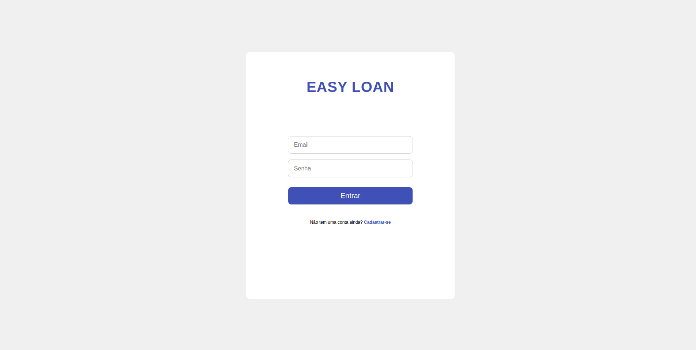
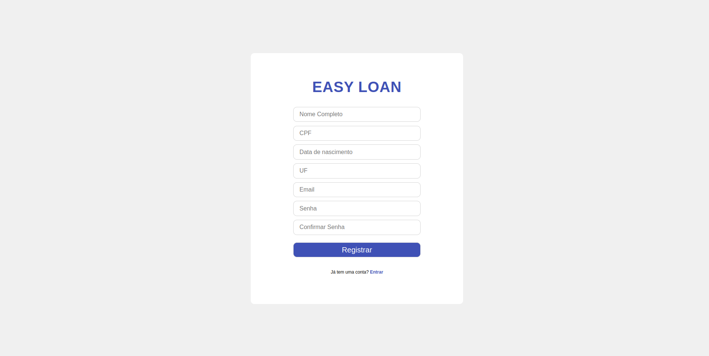
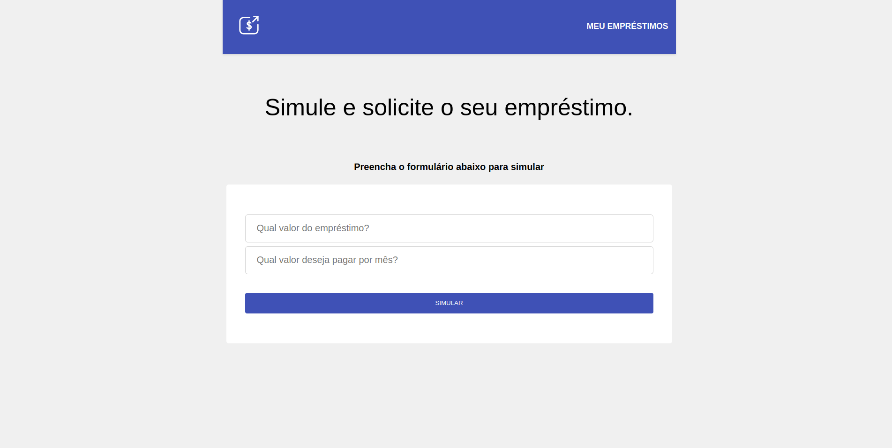
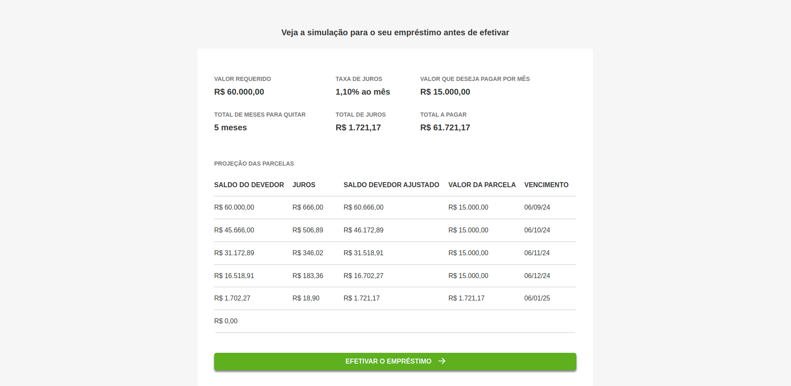
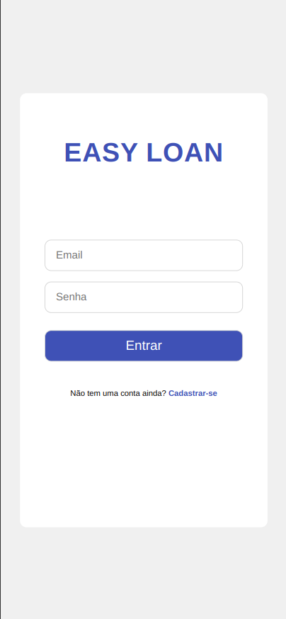
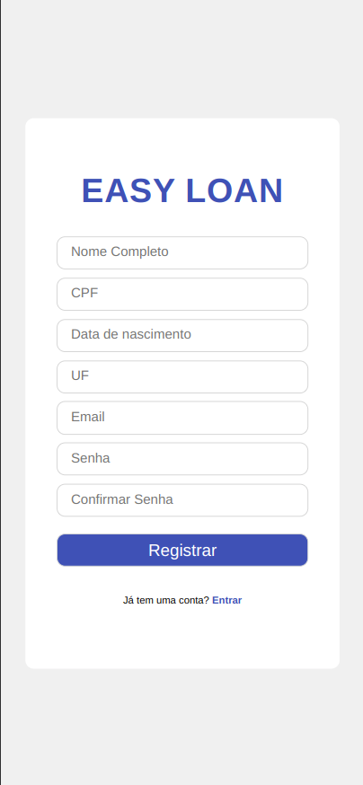
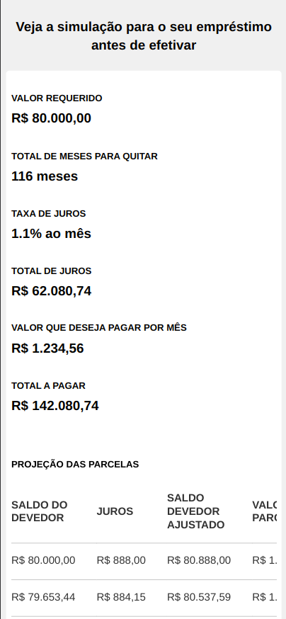
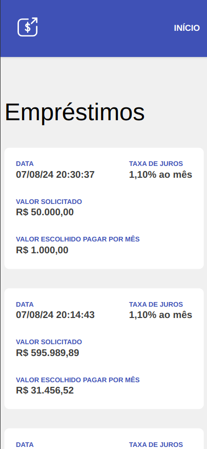

<h2 align="center" style="color:007BFF;">
	Web Application para simulação de empréstimo para pessoa física
</h2>

<p align="center">
	
	
</p>

<p align="center">
	
	
</p>

<p align="center">
	
</p>

<p align="center">
	
	
</p>

<p align="center">
	
	
	
</p>

<p align="center">
	<a href="http://18.231.175.178:5174/">Abrir aplicação</a>
</p>


## 📌 Overview
Esta é uma aplicação full stack desenvolvida para simular empréstimos pessoais. Ela permite que os usuários insiram suas informações e recebam uma simulação detalhada dos termos do empréstimo, como parcelas mensais e juros. A aplicação também oferece funcionalidades para aplicar para um empréstimo e visualizar todos os empréstimos cadastrados.

## 🌐 Endpoints

### 1. Simular Empréstimo:

**URL:** `http://18.231.175.178:3000/v1/loans/simulate`

**Método:** `POST`

**Request Body:**

```json
{
  "userCpf": "string",
  "userUf": "string",
  "userBirthdate": "Date",
  "total": "number",
  "monthlyInstallment": "number"
}
```
**Response:**
```json
[
  {
    "number": "number",
    "outstandingBalance": "number",
    "interest": "number",
    "adjustedOutstandingBalance": "number",
    "amount": "number",
    "dueData": "Date"
  }
]
```

### 2. Aplicar para Empréstimo:
**URL**: http://18.231.175.178:3000/v1/loans/apply

**Método**: `POST`

**Request Body:**
```json
{
  "userCpf": "string",
  "userUf": "string",
  "userBirthdate": "Date",
  "total": "number",
  "monthlyInstallment": "number"
}
```

**Response:**
```json
{
  "loanId": "string"
}
```

### 3. Obter Todos os Empréstimos:
**URL**: http://18.231.175.178:3000/v1/loans/all

**Método**: `GET`

**Response:**
```json
[
  {
    "id": "string",
    "userCpf": "string",
    "userUf": "string",
    "userBirthdate": "Date",
    "total": "number",
    "monthlyInstallment": "number",
    "date": "Date"
  }
]
```

## 🔧 Tecnologias:
- Express.js
- Node.js
- React
